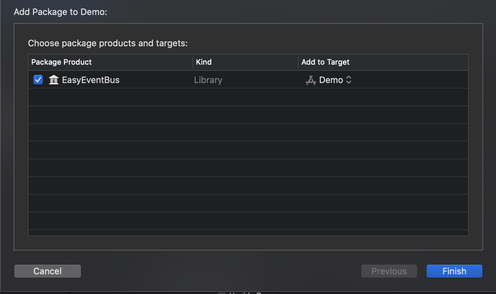

# EasyEventBus

A publish/subscribe EventBus for iOS.

## Installation

### Cocoapods

```ruby
pod 'EasyEventBus'
```

### Swift Package Manager

From Xcode 11, you can use Swift Package Manager to add EasyEventBus to your project.

1. Select File > Swift Packages > Add Package Dependency. Enter `https://github.com/supermanyqq/EasyEventBus.git` in the "Choose Package Repository" dialog.
2. In the next page, specify the version resolving rule as "Up to Next Major" with "0.0.5" as its earliest version.
3. After Xcode checking out the source and resolving the version, you can choose the "EasyEventBus" library and add it to your app target.



## Usage

### 1. Create an event object

For a type of event, you need to create an object that adopt `EasyEvent` protocol to provide an event key

```Swift
struct Person: EasyEvent {
    static var key: String {
        return "PostEventKey"
    }
}

// or

// Passing some data to Observer
struct Person: EasyEvent {
    static var key: String {
        return "PostEventKey"
    }
    
    let name: String
    let age: Int
}

```

### 2. Post event

Post an event from any part of your code.

```Swift
let person = Person(name: "Jack", age: 20)

// All subscribers matching the Person.key will receive it
EasyEventBus.shared.post(event: person)

// or

// Post an event to the assign observer
EasyEventBus.shared.post(event: person, to: Observer.self)
```

### 3. Subscribe event

To subscribe an event, you need pass event type and observer type to the method

```Swift
// subscribe on main queue by default
EasyEventBus.shared.subscribe(event: Person.self, target: Observer.self) { (person) in
    // do someting with Person object on main queue
    print("name: \(person.name), age: \(person.age)") // name: Jack, age: 20
}

// or
 
// assign a queue to subscribe event   
EasyEventBus.shared.subscribe(event: Person.self, target: Observer.self, queue: .global) { (person) in
    // do someting with Person object on global queue
    print("name: \(person.name), age: \(person.age)") // name: Jack, age: 20
}
```

### 4. Remove observer

```Swift
// Remove all subscribers matching the Person.key
EasyEventBus.shared.remove(event: Person.self)

// or

// Remove all subscribers that on assign Observer
EasyEventBus.shared.remove(target: Observer.self)

// or

// Remove all subscribers matching Person.key that on assign Observer
EasyEventBus.shared.remove(event: Person.self, for: ViewController.self)

// or

// Remove all subscribers
EasyEventBus.shared.removeAllObservers()
```

## License

EasyEventBus is released under the MIT license. See LICENSE for details.